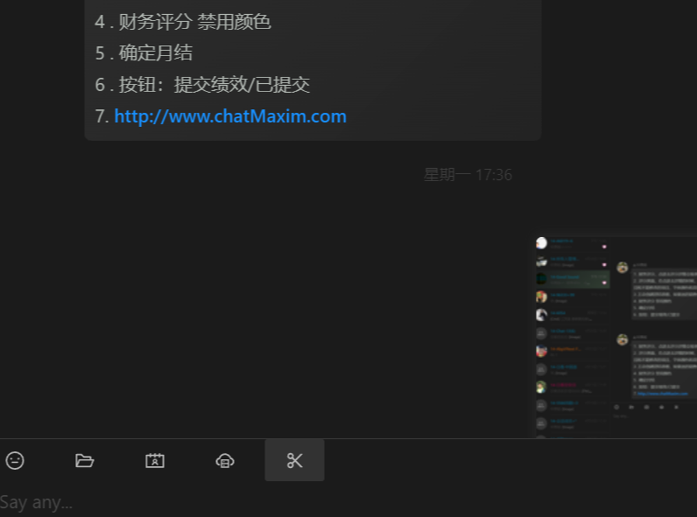

# **Chat Maxim(Electron-Vite) document**

## 待完成事项

- [ ] 1. 退出登录（所有窗口关闭）
- [ ] 2. 创建群/转发窗口 扩大
- [ ] 3. 会话搜索、全局搜索 App-Search
- [ ] 4.  消息输入框(`ChatInput.vue`)  mentions 对接
- [ ] 5. 多端登录
- [ ] 6. 用户简介窗口（UserProfile）页

## Security Log

- [ ] 1. 登录日志
- [ ] 2. 退出

## Audit Log

1.

## 

## Settings

## Config
